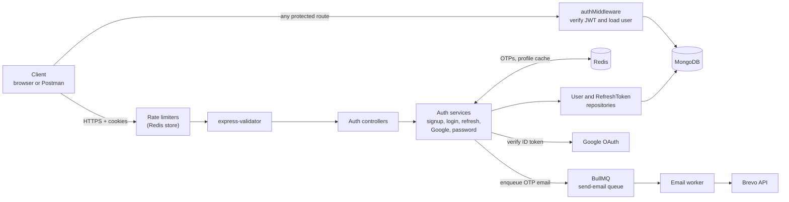
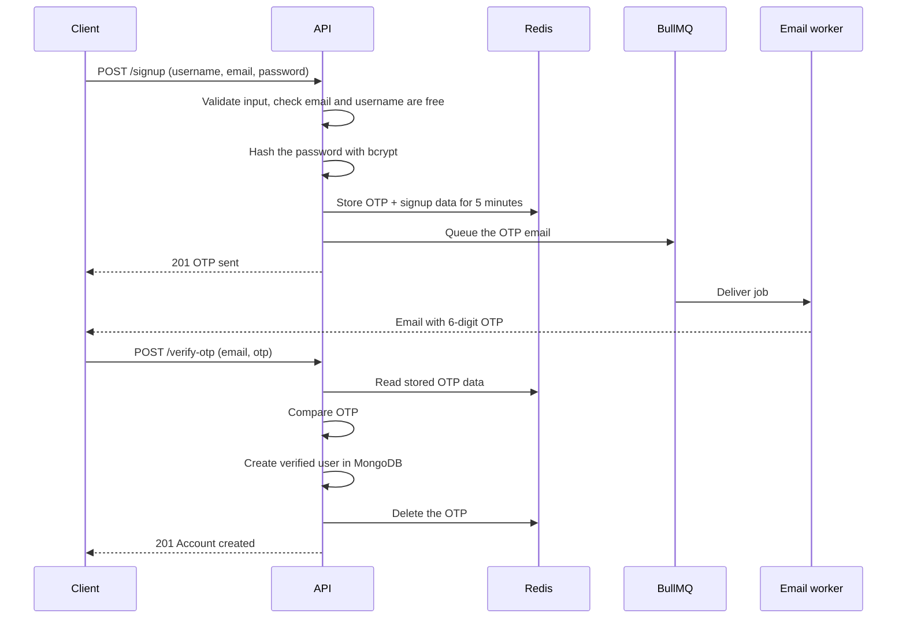
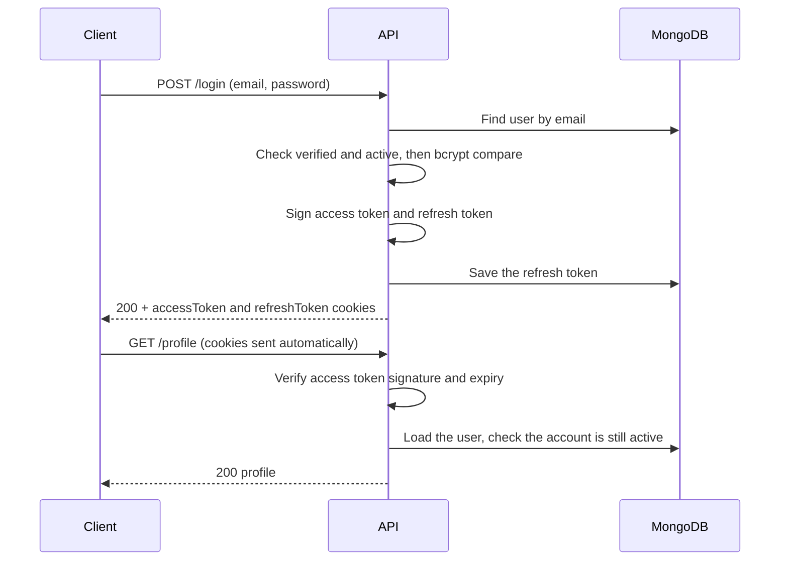
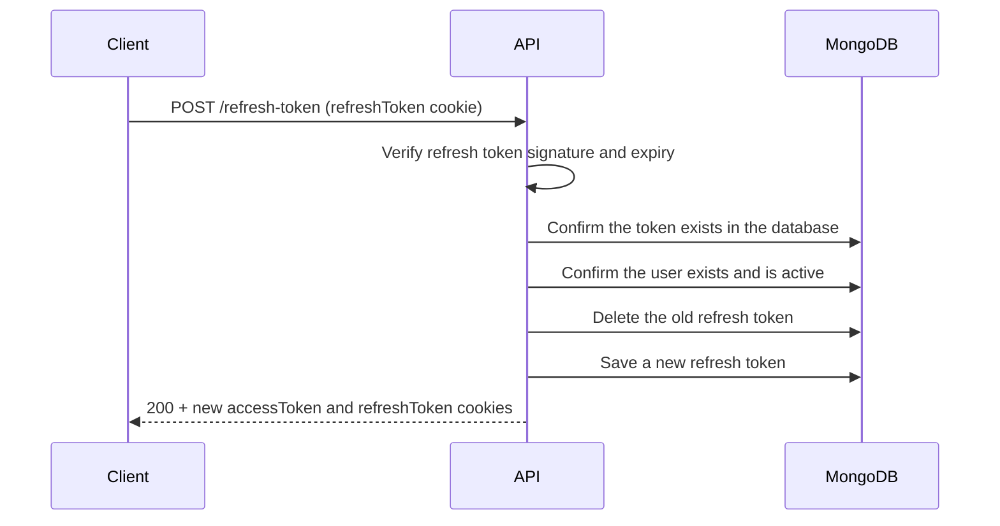
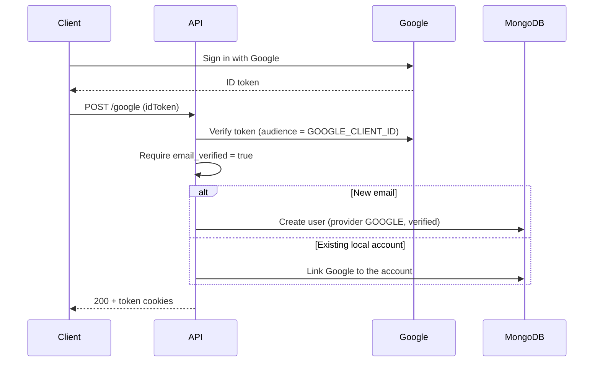

<div align="center">

# 🔐 Authentication System

**Email + OTP signup, JWT sessions with rotating refresh tokens, Google sign-in, and password recovery, built for a Node.js / Express API.**

<p>
  
  
  
  
  
  
</p>

</div>

This document covers only the **authentication and account system** of the [Invoice Processing & Async Email Automation API](https://github.com/nikhilsingh2764/invoice-processing-and-async-email-automation-api). Every protected route in the API (business, customers, products, invoices, dashboard) is guarded by the middleware described here.

---

## 📑 Table of Contents

- [Features](#-features)
- [Tech Stack](#️-tech-stack)
- [Architecture](#️-architecture)
- [Authentication Flows](#-authentication-flows)
- [Token & Cookie Design](#-token--cookie-design)
- [API Endpoints](#-api-endpoints)
- [Validation Rules](#-validation-rules)
- [Data Models](#️-data-models)
- [Redis Usage](#-redis-usage)
- [Security Measures](#️-security-measures)
- [Configuration](#️-configuration)
- [Try It](#-try-it)
- [Code Map](#-code-map)
- [Hardening Roadmap](#️-hardening-roadmap)

---

## ✨ Features

- **Email signup with OTP verification.** An account is created only after the user proves they own the email address.
- **Login with short-lived access tokens** and long-lived refresh tokens, both delivered as `HttpOnly` cookies, so JavaScript in the browser can never read them.
- **Refresh-token rotation.** Each refresh issues a new pair and deletes the old refresh token from the database.
- **Google sign-in.** The Google ID token is verified on the server, then the user is created or linked automatically.
- **Password recovery by OTP**, plus authenticated password change.
- **Account management:** profile read and update, deactivate, and permanent delete (with password confirmation).
- **Redis-backed rate limiting** on the sensitive endpoints, so limits are shared across server instances.
- **Background email delivery.** OTP and reset emails are queued in BullMQ, so signup never waits on an email provider.

---

## 🛠️ Tech Stack

Only the pieces the auth system uses:

| Concern | Technology | Role in auth |
| --- | --- | --- |
| **Runtime & framework** | Node.js 20, Express 5 | HTTP server, routing, middleware |
| **Session tokens** | `jsonwebtoken` (JWT) | Signs and verifies access and refresh tokens |
| **Password hashing** | `bcrypt` (10 salt rounds) | Stores and checks passwords |
| **Social login** | `google-auth-library` | Verifies Google ID tokens |
| **User database** | MongoDB + Mongoose | `User` and `RefreshToken` collections |
| **Temporary state & cache** | Redis (`ioredis`) | OTP storage, profile cache, rate-limit counters |
| **Rate limiting** | `express-rate-limit` + `rate-limit-redis` | Per-route limits stored in Redis |
| **Email queue** | BullMQ | Delivers OTP and reset emails in the background |
| **Email delivery** | Brevo transactional API | Sends the actual emails |
| **Input validation** | `express-validator` | Validates every auth request body |
| **Cookies & HTTP security** | `cookie-parser`, Helmet, CORS | Cookie handling, security headers, origin control |
| **Logging** | Winston | Structured logs for auth events |
| **Messages** | i18next (English and Hindi catalogs) | Translated error and success messages |
| **API docs** | swagger-jsdoc, swagger-ui-express | Auth routes are documented with OpenAPI annotations |

---

## 🏗️ Architecture



The auth code follows the same layers as the rest of the API: **routes → controllers → services → repositories → models**.

---

## 🔄 Authentication Flows

### 1. Signup with OTP verification



The user record is **not created until the OTP is verified**. The password is hashed before it is placed in Redis, so a plain-text password is never stored.

### 2. Login and authenticated requests



An unknown email and a wrong password return the **same error message**, so the login endpoint does not reveal which emails are registered.

### 3. Refresh-token rotation



A refresh token is **single use**. Once it has been exchanged, or removed by logout, replaying it fails.

### 4. Google sign-in



### 5. Forgot and reset password

1. `POST /forgot-password` with the email. The API generates a 6-digit OTP, stores it in Redis for 5 minutes, and queues the email.
2. `POST /reset-password` with `email`, `otp`, `newPassword` and `confirmPassword`. The API checks the OTP, hashes the new password, saves it, and deletes the OTP.
3. Google-only accounts are refused, because they have no password to reset.

---

## 🍪 Token & Cookie Design

| | Access token | Refresh token |
| --- | --- | --- |
| **Purpose** | Authorizes API requests | Gets a new access token |
| **Payload** | user `id`, `email` | user `id` |
| **Signed with** | `ACCESS_TOKEN_SECRET` | `REFRESH_TOKEN_SECRET` (separate secret) |
| **Lifetime** | Set by `ACCESS_TOKEN_EXPIRES_IN`; cookie lasts 15 minutes | Set by `REFRESH_TOKEN_EXPIRES_IN`; cookie and database record last 15 days |
| **Stored server-side** | No (stateless) | Yes, in the `RefreshToken` collection |
| **Cookie name** | `accessToken` | `refreshToken` |

All auth cookies are set with:

| Attribute | Value | Why |
| --- | --- | --- |
| `HttpOnly` | `true` | Blocks JavaScript access, which limits the damage of XSS |
| `Secure` | `true` | Sent over HTTPS only |
| `SameSite` | `None` | Allows the separately hosted frontend to call the API with credentials |

Because the tokens travel in cookies, browser clients must send requests with credentials enabled (`credentials: "include"`), and the API's CORS setting only allows the origin in `CLIENT_URL`.

**On every protected request** the middleware verifies the access token, then loads the user from the database and checks `isActive`. A deactivated or deleted account is therefore locked out immediately, even if its token has not expired yet.

---

## 🔌 API Endpoints

Base path: `/api/v1`. Successful responses use `{ success, statuscode, message, data }`; errors use `{ success: false, message }`.

| Method | Endpoint | Auth | Rate limit (per client IP) | Purpose |
| --- | --- | --- | --- | --- |
| POST | `/signup` | No | 30 / hour | Start signup and send an OTP |
| POST | `/verify-otp` | No | 30 / 15 min | Verify the OTP and create the account |
| POST | `/login` | No | 15 / min | Log in and set cookies |
| POST | `/google` | No | none yet | Sign in with a Google ID token |
| POST | `/refresh-token` | Refresh cookie | 30 / min | Rotate tokens |
| POST | `/forgot-password` | No | 3 / 15 min | Send a password-reset OTP |
| POST | `/reset-password` | No | 30 / 15 min | Reset the password with the OTP |
| GET | `/profile` | Yes | 200 / 15 min | Get the current user (cached) |
| POST | `/logout` | Yes | none | Delete the refresh token and clear cookies |
| PATCH | `/update-profile` | Yes | 200 / 15 min | Change username |
| PATCH | `/change-password` | Yes | 200 / 15 min | Change password (needs the old one) |
| PATCH | `/deactivate-account` | Yes | 200 / 15 min | Deactivate the account |
| DELETE | `/delete-account` | Yes | 200 / 15 min | Permanently delete (needs the password) |

Full request and response schemas are in the Swagger UI at `/api-docs`.

---

## ✅ Validation Rules

All request bodies are validated with `express-validator` before they reach a controller.

| Field | Rule |
| --- | --- |
| **Username** | 3 to 30 characters; letters, numbers and underscores only |
| **Email** | Valid email format, trimmed, lower-cased and normalized |
| **Password** | At least 8 characters, with one uppercase letter, one lowercase letter, one number, and one special character from `@ $ ! % * ? &` |
| **OTP** | Exactly 6 digits, numbers only |
| **Reset password** | `confirmPassword` must match `newPassword` |

---

## 🗄️ Data Models

**User**

| Field | Type | Notes |
| --- | --- | --- |
| `username` | String | Unique, 3 to 30 characters |
| `email` | String | Unique, stored lower-case |
| `password` | String | bcrypt hash; excluded from queries by default; required only for `LOCAL` accounts |
| `provider` | `LOCAL` or `GOOGLE` | How the account signs in |
| `googleId` | String | Set for Google accounts |
| `isVerified` | Boolean | `true` after OTP or Google verification |
| `isActive` | Boolean | `false` after deactivation |
| `failedLoginAttempts`, `lockUntil` | Number, Date | Failed-login tracking fields |
| `createdAt`, `updatedAt` | Date | Timestamps |

**RefreshToken**

| Field | Type | Notes |
| --- | --- | --- |
| `userId` | ObjectId → User | Owner of the token |
| `token` | String | The refresh JWT |
| `expiresAt` | Date | 15 days after issue |

---

## ⚡ Redis Usage

| Purpose | Key | TTL |
| --- | --- | --- |
| Signup OTP and pending account data | `otp:EMAIL_VERIFICATION:{email}` | 5 minutes |
| Password-reset OTP | `otp:PASSWORD_RESET:{email}` | 5 minutes |
| Cached profile | `profile:{userId}` | 5 minutes (cleared on profile update and account deletion) |
| Rate-limit counters | `login:`, `signup:`, `verifyOtp:`, `forgotPassword:`, `refreshToken:`, `api:` prefixes | Per limiter window |

---

## 🛡️ Security Measures

| Measure | How it works |
| --- | --- |
| **Password hashing** | bcrypt with 10 salt rounds; the hash is never returned by queries by default |
| **No plain-text passwords in Redis** | The signup password is hashed before it is stored alongside the OTP |
| **Email ownership check** | Accounts are created only after a valid OTP; OTPs expire after 5 minutes and are deleted after use |
| **Token separation** | Access and refresh tokens use different secrets |
| **Token theft resistance** | `HttpOnly`, `Secure` cookies; refresh tokens are single use and stored server-side |
| **Instant revocation** | Every request re-checks the user's `isActive` status in the database |
| **Login error hygiene** | Unknown email and wrong password produce the same message |
| **Rate limiting** | Redis-backed limits on signup, OTP, login, password reset and token refresh, shared across instances |
| **Google verification** | ID token verified server-side against the configured client ID, and the Google email must be verified |
| **Input validation** | Strict rules on every request body, including a strong password policy |
| **Protected destructive actions** | Deleting an account and changing a password both require the current password |
| **Transport and headers** | Helmet, CORS limited to `CLIENT_URL`, and HTTPS-only cookies |
| **Audit trail** | Login, logout, failed attempts, token rotation and account changes are logged with Winston |

---

## ⚙️ Configuration

| Variable | Purpose |
| --- | --- |
| `ACCESS_TOKEN_SECRET` | Signs access tokens |
| `ACCESS_TOKEN_EXPIRES_IN` | Access token lifetime, for example `15m` |
| `REFRESH_TOKEN_SECRET` | Signs refresh tokens (use a different value) |
| `REFRESH_TOKEN_EXPIRES_IN` | Refresh token lifetime, for example `15d` |
| `GOOGLE_CLIENT_ID` | Google OAuth client ID used to verify ID tokens |
| `MONGODB_URI` | MongoDB connection string |
| `REDIS_URL` | Redis connection string (OTPs, cache, rate limits, queue) |
| `BREVO_API_KEY` | Brevo API key for sending OTP emails |
| `EMAIL_USER` | Verified sender address in Brevo |
| `CLIENT_URL` | Frontend origin allowed by CORS |

Generate long random secrets, for example:

```bash
node -e "console.log(require('crypto').randomBytes(64).toString('hex'))"
```

Never commit your `.env` file.

---

## 🧪 Try It

Replace `BASE` with your server, for example `http://localhost:8000/api/v1` or the live API. Cookies are saved to a jar file so later requests stay logged in.

> `Secure` cookies need HTTPS. Browsers and Postman handle `localhost`, but `curl` over plain `http://` may not store them, so use Postman locally or test against an HTTPS URL.

```bash
BASE=https://invoice-backend-drqr.onrender.com/api/v1

# 1. Sign up (an OTP is emailed to you)
curl -X POST $BASE/signup \
  -H "Content-Type: application/json" \
  -d '{"username":"demo_user","email":"you@example.com","password":"Str0ng@Pass"}'

# 2. Verify the OTP from your inbox
curl -X POST $BASE/verify-otp \
  -H "Content-Type: application/json" \
  -d '{"email":"you@example.com","otp":"123456"}'

# 3. Log in and save the cookies
curl -c cookies.txt -X POST $BASE/login \
  -H "Content-Type: application/json" \
  -d '{"email":"you@example.com","password":"Str0ng@Pass"}'

# 4. Call a protected route
curl -b cookies.txt $BASE/profile

# 5. Rotate tokens
curl -b cookies.txt -c cookies.txt -X POST $BASE/refresh-token

# 6. Log out
curl -b cookies.txt -X POST $BASE/logout
```

A ready-made request set is also available in the [Postman collection](https://www.postman.com/technical-physicist-35686083-s-team/workspace/invoice-generator-api/collection/39798617-83cff721-5ce7-4e00-ba58-0d49017d3f39?action=share&creator=39798617).

---

## 🗂️ Code Map

```text
Backend/src/
├── route/auth/           user.routes.js, token.routes.js
├── controller/auth/      user.controller.js, token.controller.js, googleAuth.controller.js
├── service/auth/         auth.service.js, refreshToken.service.js,
│                         otp.service.js, googleAuth.service.js, email.service.js
├── repository/auth/      user.repository.js, refreshToken.repository.js, otp.repository.js
├── model/auth/           auth.model.js (User), refreshToken.model.js
├── middleware/           auth.middleware.js, rateLimiter.middleware.js, validate.js
├── validators/           auth.validator.js
├── utils/                generateToken.js, generateOTP.js, googleVerify.js, cookieOptions.js
├── queues/ + worker/     email.queue.js, email.worker.js
└── templates/            otp, welcome, and reset-password email templates
```

---

## 🗺️ Hardening Roadmap

Planned improvements to take the system from solid to production-grade:

- [ ] **Enforce the login lock window.** The `failedLoginAttempts` and `lockUntil` fields are already modelled and updated; add the check that rejects logins while `lockUntil` is in the future
- [ ] **Persist Google-issued refresh tokens** so Google sessions can rotate like password sessions
- [ ] **Revoke all refresh tokens** on password change, password reset, and account deactivation
- [ ] **TTL index on `RefreshToken.expiresAt`** to purge expired records, and store token hashes instead of raw tokens
- [ ] **Cryptographically secure OTPs** (`crypto.randomInt`) with a per-email attempt limit
- [ ] **Rate limiting and validation on `/google`**
- [ ] **Automated tests** (Jest and Supertest) for every flow above
