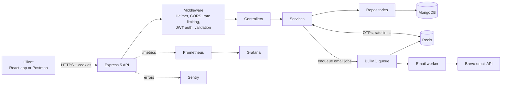
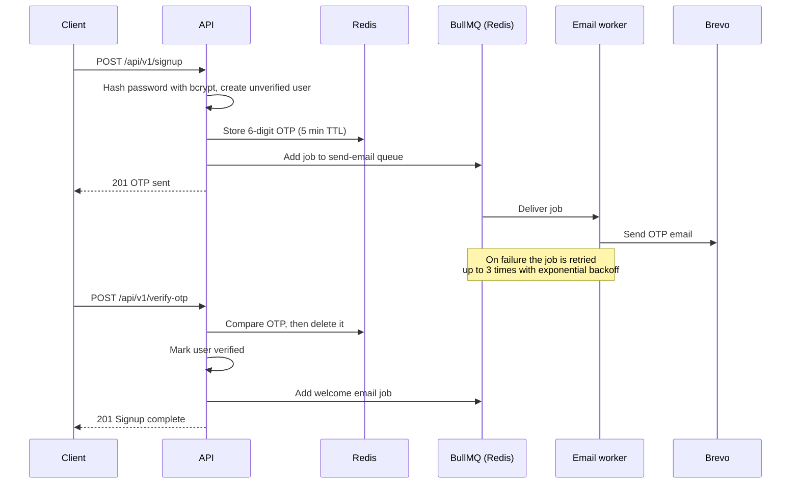
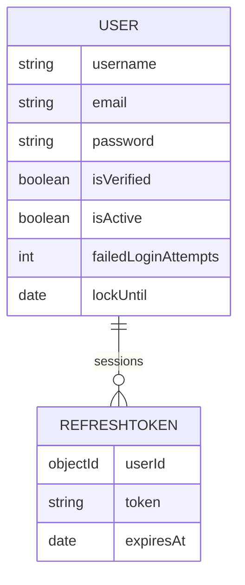
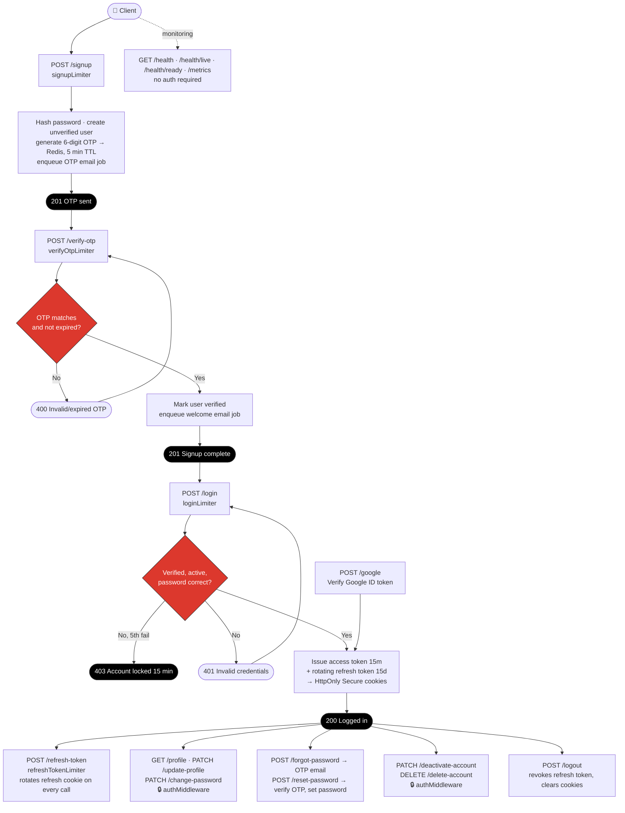
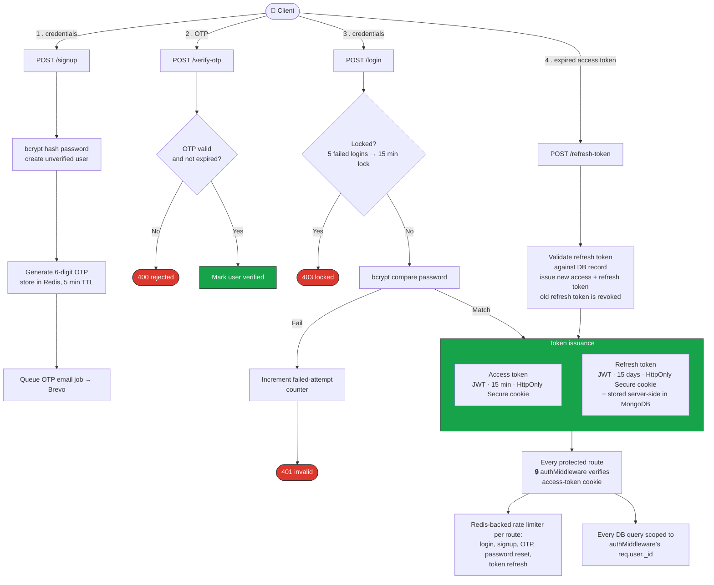

<div align="center">

# 🔐 Authentication API — OTP, JWT & Async Email

**A production-style authentication service with OTP email verification, rotating refresh tokens, account lockout, and background email delivery powered by BullMQ and Redis.**

<p>
  <a href="https://github.com/nikhilsingh2764/invoice-processing-and-async-email-automation-api/actions/workflows/ci.yml"></a>
  
  
  
  
  
  
  
</p>

<p>
  <a href="https://invoice-backend-drqr.onrender.com/api/v1/health">Live API</a> ·
  <a href="https://invoice-backend-drqr.onrender.com/api-docs">Swagger Docs</a> ·
  <a href="https://www.postman.com/technical-physicist-35686083-s-team/workspace/invoice-generator-api/collection/39798617-83cff721-5ce7-4e00-ba58-0d49017d3f39?action=share&creator=39798617">Postman Collection</a>
</p>

</div>

> **Note:** The live API runs on Render's free tier, so the first request after a period of inactivity can take a few seconds while the service wakes up.

---

## 📖 About

This is the authentication module of **InvoicePilot**, an invoice management platform. It handles everything about who a user is and whether they are allowed in: signup with email verification, login, Google sign-in, session refresh, password recovery, and account management.

The main goal was to build it the way a real auth service is built, not as a simple login demo:

- **Slow work never blocks a request.** OTP, welcome, and password-reset emails are sent by background workers (BullMQ on Redis) with automatic retries and exponential backoff, so the API answers immediately.
- **Security is layered.** OTP email verification, bcrypt password hashing, short-lived JWT access tokens with rotating refresh tokens in HTTP-only cookies, account lockout, and Redis-backed rate limiting on every sensitive endpoint.
- **It is observable and deployable.** Health probes, Prometheus metrics with a Grafana dashboard, Sentry error tracking, structured JSON logs, a Docker image, and a CI/CD pipeline that deploys to Render and verifies the release.

---

## ✨ Features

**Signup & verification**
- Email signup with a 6-digit OTP sent by email
- OTP stored in Redis with a 5-minute expiry and deleted after use
- Accounts stay unverified, and cannot log in, until the OTP is confirmed
- Welcome email sent after successful verification

**Login & sessions**
- Email and password login
- Google sign-in with server-side verification of the Google ID token
- 15-minute access token and 15-day refresh token, both in `HttpOnly`, `Secure` cookies
- Refresh tokens stored server-side and rotated on every use
- Logout that revokes the refresh token and clears cookies

**Account protection**
- Account lockout for 15 minutes after 5 failed logins
- Redis-backed rate limiting on signup, OTP verification, login, and token refresh
- Forgot and reset password by OTP
- Change password, update profile, deactivate account, delete account

**Async processing**
- OTP, welcome, and password-reset emails sent through the Brevo API from a worker
- Three retry attempts with exponential backoff for every email job

**Operations**
- Health, liveness and readiness endpoints that check MongoDB and Redis
- Prometheus metrics endpoint plus a Grafana container
- Sentry error tracking and Winston structured logging
- Graceful shutdown of the HTTP server, workers, Redis and MongoDB
- Interactive API docs with Swagger UI (OpenAPI 3.0)

---

## 🏗️ Architecture



The code follows a strict layered structure: **routes → controllers → services → repositories → models**. Controllers handle HTTP only, services hold the business logic, and repositories are the only layer that talks to MongoDB.

### Example: signup and OTP email



### Background queue

| Queue | Purpose | Worker action |
| --- | --- | --- |
| `send-email` | OTP, welcome, and password-reset emails | Sends the email through Brevo |

The queue uses 3 attempts with exponential backoff (5 s base delay) and keeps the last 100 completed and failed jobs. The worker processes up to 5 jobs concurrently. Workers start together with the API process, and `npm run worker` runs the email worker on its own.

---

## 🗄️ Data Model

Authentication uses two MongoDB collections. OTPs and rate-limit counters live in Redis, not in MongoDB.



| Field | Purpose |
| --- | --- |
| `password` | bcrypt hash, never the plain password |
| `isVerified` | Becomes `true` only after the signup OTP is confirmed |
| `isActive` | Set to `false` when the account is deactivated |
| `failedLoginAttempts`, `lockUntil` | Drive the 5-failures, 15-minute lockout |
| `REFRESHTOKEN.token` | Server-side copy used to validate and revoke sessions |
| `REFRESHTOKEN.expiresAt` | Expiry of the refresh token |

---

## 🗺️ Route Flow (all auth endpoints)

A single journey through every auth route in the order a real client calls them — sign up, verify, log in, keep the session alive, recover a password, and manage the account. Each step carries its rate limiter and its Redis/BullMQ behavior.



**How to read it for an interview walkthrough:**
- Follow the main path: `signup → verify-otp → login → refresh-token`. OTPs live in Redis with a 5-minute TTL, tokens live in HttpOnly cookies, and refresh tokens rotate on every use.
- The branch diamonds (`OTP valid?`, `login valid?`) are the actual conditional logic in the services, useful for explaining lockouts and expiry.
- Every sensitive route carries its own Redis-backed rate limiter, so limits hold even if the API scales to multiple instances.

---

## 🛠️ Tech Stack

| Category | Technologies |
| --- | --- |
| **Runtime & framework** | Node.js 20, Express 5 (ES modules) |
| **Database** | MongoDB with Mongoose 9 |
| **Cache & queues** | Redis (ioredis), BullMQ |
| **Auth & security** | JWT, bcrypt, Helmet, CORS, express-rate-limit with rate-limit-redis, Google OAuth (google-auth-library) |
| **Validation** | express-validator |
| **Email** | Brevo transactional email API |
| **Observability** | Winston, Morgan, Sentry, Prometheus (prom-client), Grafana |
| **API docs** | swagger-jsdoc, swagger-ui-express |
| **i18n** | i18next with English and Hindi message catalogs |
| **DevOps** | Docker, Docker Compose, GitHub Actions, Render |
| **Tooling** | Git, Postman, Nodemon |

---

## 📁 Project Structure

```text
.
├── .github/workflows/ci.yml        # CI/CD pipeline
└── Backend/
    ├── Dockerfile
    ├── docker-compose.yml          # API + Redis + MongoDB + Prometheus + Grafana
    ├── prometheus/prometheus.yml
    ├── .env.example
    └── src/
        ├── server.js               # Startup, workers, graceful shutdown
        ├── app.js                  # Middleware and route registration
        ├── config/                 # db, redis, sentry, swagger, metrics, i18n
        ├── route/                  # Routes with Swagger annotations
        ├── controller/             # HTTP layer
        ├── service/                # Business logic (OTP, login, tokens)
        ├── repository/             # Database access
        ├── model/                  # Mongoose schemas (user, refresh token)
        ├── validators/             # express-validator rules
        ├── middleware/             # auth, rate limiters, errors, metrics, logging
        ├── queues/                 # BullMQ queue definitions
        ├── worker/                 # BullMQ email worker
        ├── templates/              # HTML email templates
        ├── locales/                # en and hi translations
        └── utils/                  # logger, ApiError, token helpers
```

---

## 🔌 API Reference

Base path: `/api/v1`. Interactive documentation is available at `/api-docs`.

<details open>
<summary><b>Authentication</b></summary>

| Method | Endpoint | Auth | Description |
| --- | --- | --- | --- |
| POST | `/signup` | No | Start signup and send an OTP by email |
| POST | `/verify-otp` | No | Verify the OTP and activate the account |
| POST | `/login` | No | Log in and set access and refresh cookies |
| POST | `/google` | No | Sign in with a Google ID token |
| POST | `/refresh-token` | Cookie | Rotate the refresh token and issue new tokens |
| POST | `/forgot-password` | No | Send a password-reset OTP |
| POST | `/reset-password` | No | Reset the password with the OTP |
| GET | `/profile` | Yes | Get the current user |
| POST | `/logout` | Yes | Log out and revoke the refresh token |
| PATCH | `/update-profile` | Yes | Update profile details |
| PATCH | `/change-password` | Yes | Change password |
| PATCH | `/deactivate-account` | Yes | Deactivate the account |
| DELETE | `/delete-account` | Yes | Delete the account |

</details>

<details>
<summary><b>Operations</b></summary>

| Method | Endpoint | Description |
| --- | --- | --- |
| GET | `/health` | Full health check (API, MongoDB, Redis) |
| GET | `/health/live` | Liveness probe |
| GET | `/health/ready` | Readiness probe (returns `503` when a dependency is down) |
| GET | `/metrics` | Prometheus metrics |

</details>

---

## 🔐 Security

| Area | Implementation |
| --- | --- |
| **Password storage** | bcrypt hashing with salt |
| **Email verification** | 6-digit OTP stored in Redis with a 5-minute expiry; the account cannot log in until it is verified |
| **Sessions** | 15-minute access token and 15-day refresh token, both in `HttpOnly`, `Secure` cookies |
| **Refresh tokens** | Stored server-side and rotated on every use, so a used or revoked token stops working |
| **Brute-force protection** | Account locks for 15 minutes after 5 failed logins, plus per-route rate limiting |
| **Rate limiting** | Redis-backed limiters for login, signup, OTP, password reset, and token refresh, so limits hold across multiple server instances |
| **Data isolation** | Every repository query is scoped by the authenticated user's ID |
| **HTTP hardening** | Helmet headers, CORS restricted to `CLIENT_URL` with credentials, `trust proxy` for deployment behind a load balancer |
| **Input validation** | express-validator rules on every write endpoint |
| **Errors** | One central error handler returns clean JSON to clients while stack traces go to logs and Sentry |

### Authentication flow

The four steps a client goes through: **signup → verify OTP → login → refresh token**. Every protected route afterwards is checked by `authMiddleware`, and every database query is scoped to `req.user._id`.



---

## ⚡ Redis Usage

| Data | Redis key | TTL | Invalidation |
| --- | --- | --- | --- |
| Signup and reset OTP | `otp:{type}:{email}` | 5 min | Deleted after verification |
| Rate-limit counters | Managed by `rate-limit-redis` | Per limiter window | Expire by window |
| BullMQ email jobs | Managed by BullMQ | Last 100 completed and failed jobs kept | Automatic |

---

## 📊 Observability

- **Health:** `/api/v1/health`, `/health/live` and `/health/ready` for Docker, Kubernetes, and uptime monitors
- **Metrics:** `/api/v1/metrics` exposes default Node.js metrics, `http_requests_total`, and the `http_request_duration_seconds` histogram, labelled by method, route and status code
- **Dashboards:** Prometheus and Grafana run alongside the API in Docker Compose
- **Errors:** unhandled errors are captured in Sentry
- **Logs:** Winston writes structured JSON to the console and to `logs/app.log` and `logs/error.log`

---

## 🚀 Getting Started

### Prerequisites

- Node.js 20 or later
- MongoDB (Atlas or local)
- Redis 7 or later
- A [Brevo](https://www.brevo.com/) account and API key for OTP and password-reset emails
- A Google OAuth client ID if you want Google sign-in

### Run locally

```bash
git clone https://github.com/nikhilsingh2764/invoice-processing-and-async-email-automation-api.git
cd invoice-processing-and-async-email-automation-api/Backend

cp .env.example .env      # then fill in your values
npm install
npm run dev               # API and workers on http://localhost:8000
```

### Run with Docker

```bash
cd Backend
cp .env.example .env      # required, the compose file reads it
docker compose up --build
```

| Service | URL |
| --- | --- |
| API | http://localhost:8000 |
| Swagger docs | http://localhost:8000/api-docs |
| Prometheus | http://localhost:9090 |
| Grafana | http://localhost:3000 |

The compose file overrides `REDIS_URL` and `MONGODB_URI` to point at its own containers. On macOS or Windows, change the Prometheus target in `prometheus/prometheus.yml` from `172.17.0.1:8000` to `host.docker.internal:8000`.

### Scripts

| Command | What it does |
| --- | --- |
| `npm run dev` | Start the API and workers with Nodemon |
| `npm start` | Start the API and workers (production) |
| `npm run worker` | Run the email worker as a standalone process |

### Environment variables

| Variable | Description |
| --- | --- |
| `PORT` | Server port (default `8000` in Docker) |
| `NODE_ENV` | `development` or `production` |
| `MONGODB_URI` | MongoDB connection string |
| `REDIS_URL` | Redis connection string |
| `CLIENT_URL` | Frontend origin allowed by CORS |
| `ACCESS_TOKEN_SECRET` | Secret for signing access tokens |
| `ACCESS_TOKEN_EXPIRES_IN` | Access token lifetime, for example `15m` |
| `REFRESH_TOKEN_SECRET` | Secret for signing refresh tokens |
| `REFRESH_TOKEN_EXPIRES_IN` | Refresh token lifetime, for example `15d` |
| `BREVO_API_KEY` | Brevo API key for sending email |
| `EMAIL_USER` | Verified sender address in Brevo |
| `GOOGLE_CLIENT_ID` | Google OAuth client ID |
| `SENTRY_DSN` | Sentry project DSN (optional) |

Use long, random values for the token secrets and never commit your `.env` file.

---

## 🔄 CI/CD

Every push and pull request to `main` runs the pipeline in [`.github/workflows/ci.yml`](.github/workflows/ci.yml). A push to `main` also triggers a Render deploy and verifies the live API. The right-hand side of the diagram shows the Docker Compose stack used for local and self-hosted runs.

```mermaid
flowchart LR
    Push(["👨‍💻 git push to main"]) --> GHA["GitHub Actions<br/>Invoice API CI"]

    subgraph CI["CI pipeline"]
        direction TB
        Checkout["Checkout code"] --> Setup["Setup Node.js 20 · npm ci"]
        Setup --> Build["Build Docker image"]
        Build --> Inspect["Inspect image"]
        Inspect --> Validate["docker compose config<br/>validate compose file"]
    end

    GHA --> Checkout
    Validate -->|push to main only| Deploy["Trigger Render<br/>deploy hook"]
    Deploy --> Wait["Wait ~60s for rollout"]
    Wait --> Health["curl --fail<br/>/api/v1/health"]
    Health -->|200| Live(["✅ Live on Render"])
    Health -->|fail| Failed(["❌ Pipeline fails"])

    subgraph Compose["docker-compose.yml — local & self-hosted stack"]
        direction TB
        Grafana["grafana/grafana"] -->|dashboards| Prom["prom/prometheus"]
        Prom -.->|scrapes /metrics| Api["api<br/>Node 20 / Express 5"]
        Api --> Redis[("redis:7-alpine")]
        Api --> Mongo[("mongo:8")]
    end

    Live -.-> Grafana

    classDef ok fill:#16A34A,stroke:#333,color:#fff
    classDef bad fill:#DC2626,stroke:#333,color:#fff
    class Live ok
    class Failed bad
```



The pipeline fails if the image does not build or if the deployed API does not answer its health endpoint.

---

## 🧠 Design Decisions

- **Queue instead of inline work:** third-party email calls are slow and can fail. Moving them to BullMQ keeps API latency low and gives retries and backoff for free.
- **OTP in Redis, not MongoDB:** OTPs are short-lived by nature, so a Redis key with a 5-minute TTL expires on its own and needs no cleanup job.
- **Rotating refresh tokens:** every refresh issues a new token and revokes the old one, so a stolen token that has already been used stops working.
- **Tokens in HttpOnly cookies:** JavaScript on the page cannot read them, which reduces the damage of an XSS bug.
- **Lockout on top of rate limiting:** rate limiting slows down bursts from one client, while the account lockout protects a single account from slow, distributed guessing.
- **Repository layer:** database access lives in one place, which keeps services testable and makes the user-scoping rule easy to enforce.
- **Redis for shared state:** rate limits and OTPs live in Redis, so the API can run as several instances without losing consistency.
- **Graceful shutdown:** on shutdown the server stops taking requests, lets workers finish, then closes Redis and MongoDB.

---

## 🗺️ Roadmap

- [ ] Automated tests (Jest and Supertest) for the auth flows, wired into the CI pipeline
- [ ] Bull Board dashboard for monitoring the email queue and failed jobs

---

## 👨‍💻 Author

**Nikhil Singh**, Backend Engineer

[](https://www.linkedin.com/in/nikhil-singh-802594231/)
[](mailto:nikhilsingh2764@gmail.com)
[](https://github.com/nikhilsingh2764)

If you found this project useful, consider giving it a ⭐
